# ATS Report — Week of May 18 – May 22 (Mon–Fri)

Weekly planner for the trade team. Simple, scannable. Setups, levels, bias.

---

## Economic News — Week Ahead

High-impact events to watch (red folder). Times in ET.

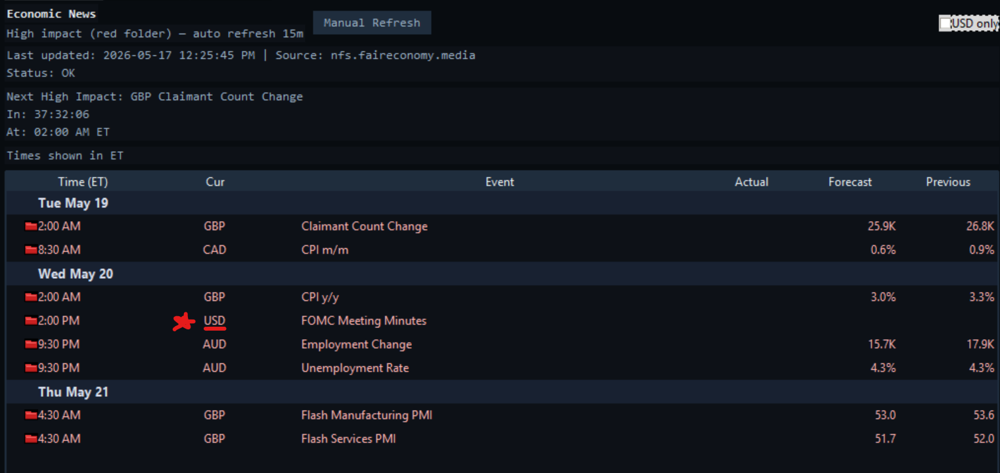

**Quick debrief:**

- **Tue May 19** — GBP Claimant Count (2:00 AM), CAD CPI m/m (8:30 AM, fcst 0.6% vs prev 0.9% — cooling).
- **Wed May 20** — GBP CPI y/y (2:00 AM, fcst 3.0% vs 3.3%), **FOMC Meeting Minutes 2:00 PM ET** — primary US catalyst, expect equity vol mid-afternoon. AUD jobs print 9:30 PM.
- **Thu May 21** — GBP Flash Manufacturing + Services PMI (4:30 AM).

**Trade-team focus:** FOMC Minutes Wed 2 PM. Size down or wait out the print on US equities. CAD CPI + GBP CPI not direct US drivers but affect cross-currency flow.

---

## PLTR — Palantir Technologies

### 1-Hour Chart

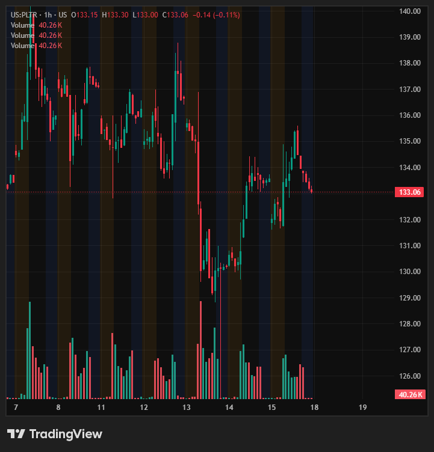

### Daily Chart

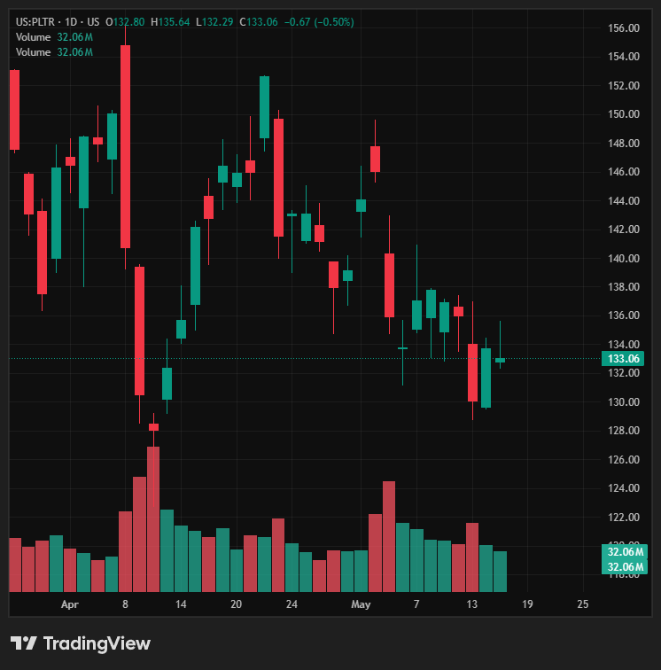

### Setup

- **Trigger:** Gap up over $134 with $134 holding Monday open, followed by expansion.
- **Bias:** Coiling above $130. Consolidated strength. Likely breakout candidate.
- **Caveat:** One of the weaker names on the overall list. Will take the setup if it triggers, but not chasing.
- **Current:** $133.06 (–0.50% on the day).
- **Key levels:**
  - Resistance: $134 (trigger), $136 (recent reclaim zone), $138 (range high).
  - Support: $130 (coil floor), $128 (4/10 swing low).

### Historical Data Audit (last ~6 weeks)

Pulled from daily change % table. Highlights:

- **Recent range:** $128 (4/10 low) → $152.62 (4/22 high). Now mid-low at $133.
- **Volatility profile:** High. Multiple ±5–7% sessions in past 6 weeks.
- **Big down days:** 4/8 –6.2%, 4/9 –7.3%, 4/23 –7.24%, 5/5 –6.93%, 5/13 –4.37%.
- **Big up days:** 4/1 +6.35%, 4/15 +4.75%, 4/22 +4.56%, 5/14 +2.83%.
- **Skew:** Down-day magnitude > up-day magnitude. Bearish vol skew last 6 weeks.
- **Last 5 sessions:** +0.19, +2.83, –4.37, –0.65, –0.66 → tight range $130–$137, coiling confirmed.
- **Volume:** Heaviest distribution day 4/10 (115.9M shares) on –1.86% — capitulation print. Volume tapering into current coil = consolidation, not active distribution.

### Analyst Ratings Audit (30 ratings reviewed, focus last 30 days)

**Skew:** Mixed, slightly bullish on calls, but **price targets trending down**.

Last 30 days (most recent first):

| Date | Firm | Analyst | Rating | Target |
|---|---|---|---|---|
| 5/6 | Citigroup | Radke | Buy | $210 → **$225** ↑ |
| 5/5 | Argus | Bonner | Hold → **Buy** ↑ | $190 |
| 5/5 | RBC Capital | Jaluria | **Underperform** | $90 (lowest) |
| 5/5 | Wedbush | Ives | Outperform | $230 (stable, highest) |
| 5/5 | DA Davidson | Luria | Neutral | $180 → **$165** ↓ |
| 5/5 | Rosenblatt | McPeake | Buy | $200 → **$225** ↑ |
| 5/1 | HSBC | Bersey | **Buy → Hold** ↓ | $205 → **$151** ↓ |
| 4/30 | Oppenheimer | Singh | Outperform | $200 |
| 4/28 | Citigroup | Radke | Buy | $260 → **$210** ↓ |

**Takeaways:**
- Bullish camp: Wedbush ($230), Rosenblatt ($225), Citi ($225), Argus upgrade.
- Bearish camp: RBC ($90 Underperform), HSBC downgrade + target slash to $151, DA Davidson cut to $165.
- **Median recent target ~$200**, with $133 spot price → ~50% upside on consensus, but recent revisions skew lower (cuts outnumber raises 4 to 3 in last 2 weeks).
- Pattern: firms raising targets are already-bullish names; firms cutting are capitulating or warning. Watch HSBC + DA Davidson for trend continuation if next leg lower.

### Plan

1. **Long trigger:** Gap > $134 on Mon open, hold $134, expansion → take.
2. **Invalidation:** Loss of $130 on volume → setup dead, no chase.
3. **Size:** Reduced — weaker name, FOMC mid-week.

---

## IREN — Iris Energy Limited

### Daily Chart

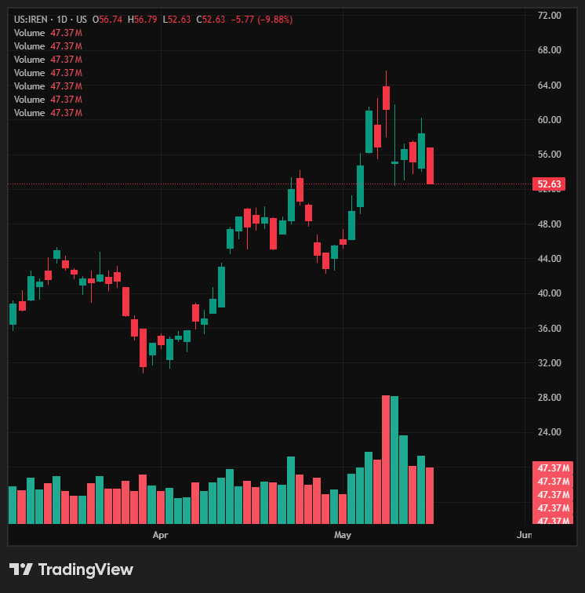

### 1-Hour Chart

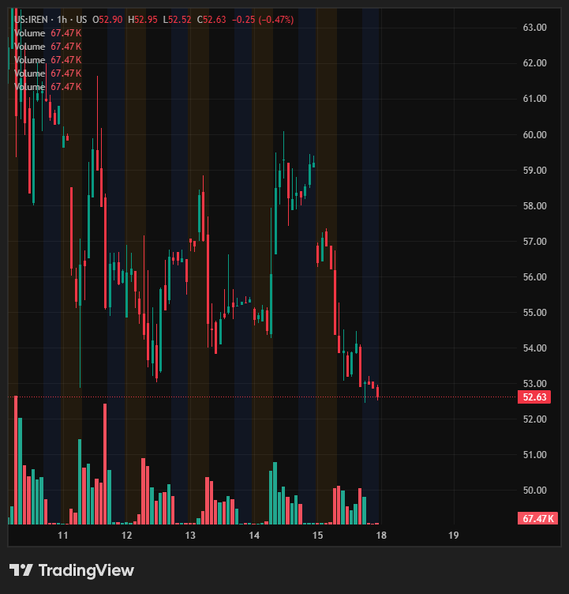

### Setup

- **Trigger:** Long over **$53.50** on breakout. Tight stop.
- **Stop:** Under **$52.50**.
- **Bias:** Bull flag consolidating beautifully after parabolic run from $34 → $66. Massive swing-trade potential on continuation.
- **Current:** $52.63 (–9.88% today — flushed into the flag low).
- **Key levels:**
  - Entry trigger: $53.50.
  - Resistance: $57 (flag top), $61 (recent pivot), $66 (range high).
  - Support: $52.50 (stop level), $50 (psych + prior breakout retest).
- **R/R:** Tight $1 risk → $7–13 reward to range high = 7–13R potential. Asymmetric.

### Historical Data Audit (last ~6 weeks)

- **Range:** $34 (early Apr low) → $66 (May high) → $52 (current). ~94% rally then ~21% pullback into flag.
- **Volatility profile:** Extreme. Daily moves of 5–11% routine.
- **Big up days:** 5/6 +11.40%, 5/5 +10.63%, 4/14 +9.98%, 4/13 +9.54%, 3/31 +8.41%, 5/8 +7.65%, 4/23 +7.50%, 4/22 +7.13%.
- **Big down days:** 5/15 –9.35% (today), 5/11 –9.89%, 4/28 –8.11%, 4/21 –7.29%, 5/7 –6.77%, 3/30 –9.89%.
- **Volume signature:** Massive distribution prints 5/11 (108.6M) + 5/8 (109.6M) at the top — classic blow-off + first pullback. Today's –9.35% on 47M is lighter than the distribution highs = sellers thinning.
- **Structure:** Higher highs / higher lows since 3/30 low ($31.62). Current pullback holding well above 4/22 breakout ($48) = trend intact.
- **Interpretation:** Bull flag confirmed. Volume contraction during the pullback supports continuation thesis. Loss of $50 would invalidate flag and threaten trend.

### Analyst Ratings Audit (30 ratings reviewed, focus last 30 days)

**Skew:** Heavy bullish. Most recent revisions raised targets.

Last 30 days (most recent first):

| Date | Firm | Analyst | Rating | Target |
|---|---|---|---|---|
| 5/11 | Macquarie | Golding | Outperform | $77 → **$90** ↑ |
| 5/11 | JP Morgan | Smith | **Underweight** | $39 → $46 ↑ (still bear) |
| 5/8 | HC Wainwright | Colonnese | Buy | $80 → **$85** ↑ |
| 5/8 | BTIG | Lewis | Buy | $75 → **$80** ↑ |
| 4/9 | Cantor Fitzgerald | Knoblauch | Overweight | $82 → **$61** ↓ |

**Takeaways:**
- Bullish camp: Macquarie ($90 high), HC Wainwright ($85), BTIG ($80) — all raised in last 2 weeks.
- Bearish camp: JPM Underweight ($46), Cantor's earlier cut ($61).
- **Median target ~$80**, spot $52.63 → **~52% upside on consensus**.
- 3 of 5 most recent revisions = raises. Analyst tailwind strong.
- Longer trend: Targets have been climbing since Sep '25 ($16–32 range) → now $80+ range. Multi-quarter upgrade cycle still intact.

### Plan

1. **Long trigger:** Break $53.50 → take with tight stop under $52.50.
2. **Risk:** $1 / share. Asymmetric R/R for swing.
3. **Target laddering:** Partial $57 (flag top), $61, runner toward $66+ range high. Manage runner with rising stop.
4. **Invalidation:** Loss of $52.50 on volume → out, reassess. Loss of $50 = flag broken.
5. **Size:** Standard / slightly aggressive — bull flag + analyst tailwind + asymmetric R/R justify confidence.

---

## ARM — Arm Holdings plc

### Daily Chart

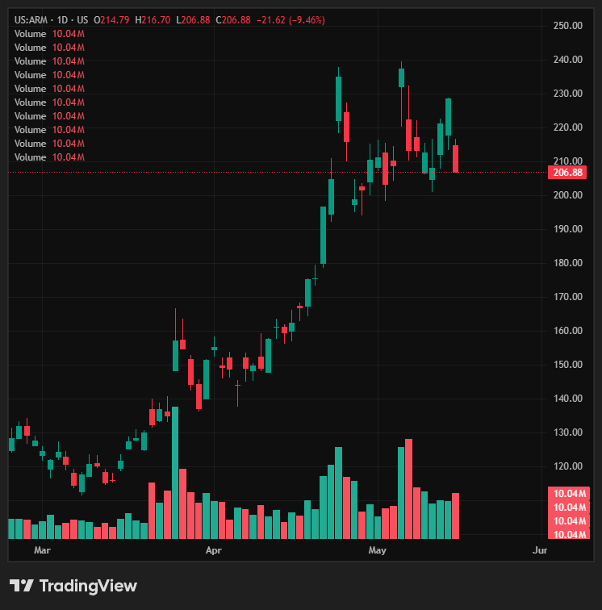

### 1-Hour Chart

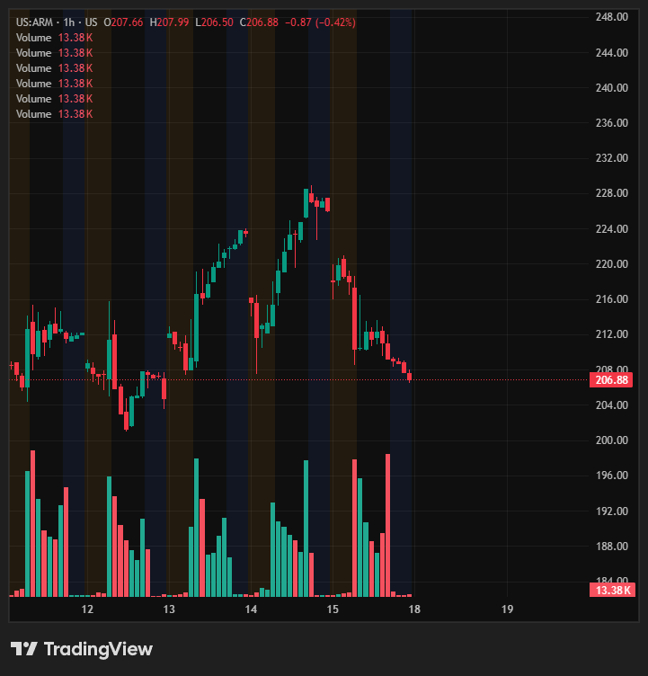

### Setup

- **Trigger:** Gap > **$212**, take entry over **$213**.
- **Stop:** Tight under **$208**.
- **Target:** ATH continuation.
- **Management:** $230s rejecting → **scale out into weakness** approaching that zone.
- **Bias:** Nice uptrend with wide consolidation range. Pulled back on 5/15 (–8.46%) to test lower end.
- **Current:** $206.88 (–9.46% recent).
- **Key levels:**
  - Entry: $212 gap / $213 confirmation.
  - Resistance: $221 (recent reclaim), $230 (rejection zone — scale), $237 (5/6 high), $240 (ATH range).
  - Support: $208 (stop), $200 (range low), $196 (4/22 swing low).

### Historical Data Audit (last ~6 weeks)

- **Range:** $120 (early Mar) → $240 (early May). ~100% rally over 9 weeks.
- **Volatility profile:** Very high. Multiple ±8–15% daily moves clustered around earnings + Fed-sensitivity windows.
- **Thrust days (long):** 4/22 +12.01% (13.8M), 4/24 +14.76% (20.4M), 5/6 +13.63% (20.3M), 3/31 +10.46%.
- **Distribution days:** 5/7 –10.11% (22.1M — biggest volume), 5/15 –8.46% (10M), 4/27 –8.06% (13.8M), 4/28 –7.98% (12.7M).
- **Earnings shock:** 5/6 +13.63% on 20.3M followed by 5/7 –10.11% on 22.1M = classic post-earnings whipsaw. Stock found range after.
- **Current structure:** Wide consolidation $200–$240 since 4/22. Today's pullback to $206 = lower-band test, not range break.
- **Volume contraction during current pullback** (10M today vs 20M+ on thrust days) supports continuation thesis.
- **$230 rejection confirmed:** Multiple wicks above $230 in late Apr / early May. Heavy supply zone — scale-out logic sound.

### Analyst Ratings Audit (30 ratings reviewed, focus last 30 days)

**Skew:** Overwhelmingly bullish. Post-earnings (5/7) tidal wave of target raises.

Last 30 days (most recent first):

| Date | Firm | Analyst | Rating | Target |
|---|---|---|---|---|
| 5/8 | Barclays | O'Malley | Overweight | $200 → **$250** ↑ |
| 5/7 | TD Cowen | O'Loughlin | Buy | $165 → **$265** ↑↑ |
| 5/7 | RBC Capital | Pajjuri | Outperform | $175 → **$260** ↑↑ |
| 5/7 | Goldman Sachs | Schneider | **Sell** | $125 → $150 (still bear) |
| 5/7 | Wells Fargo | Quatrochi | Overweight | $220 → **$255** ↑ |
| 5/7 | Guggenheim | Difucci | Buy | $240 → **$255** ↑ |
| 5/7 | Evercore ISI | Lipacis | Outperform | $227 → **$326** ↑ (HIGH) |
| 5/7 | Keybanc | Vinh | Overweight | $170 → **$300** ↑↑ |
| 5/7 | Rosenblatt | Cassidy | Buy | $175 → **$270** ↑↑ |
| 5/7 | Mizuho | Rakesh | Outperform | $255 → **$290** ↑ |
| 5/7 | Needham | Shi | Buy | $200 → **$255** ↑ |
| 5/6 | Mizuho | Rakesh | Outperform | $230 → **$255** ↑ |

**Takeaways:**
- **11 of 12 recent ratings = bullish.** Only Goldman holds Sell ($150).
- Target spread: $150 (Goldman) → **$326 (Evercore)**. Median ~$260.
- Spot $206.88 → **~26% upside to median, ~58% to high**.
- Mizuho raised target two days in a row (5/6 + 5/7) = max conviction.
- Catalyst: 5/6 earnings drove the upgrade wave. Pre-earnings 4/7 Morgan Stanley downgrade (Overweight → Equal-Weight) now stale.
- Tape + analyst alignment: both pointing higher off this pullback if $208 holds.

### Plan

1. **Long trigger:** Gap > $212 Mon, take > $213. Stop tight under $208.
2. **Risk:** ~$5–6 per share.
3. **Targets:**
   - T1: $221 reclaim — small trim.
   - T2: $230 zone — scale out aggressively into weakness (known rejection).
   - Runner: ATH retest $240+.
4. **Invalidation:** Loss of $208 on volume → out, range bottom in jeopardy. Loss of $200 = trend structure break.
5. **Size:** Standard. Wide range = vol risk, but tight stop + asymmetric upside justify entry.

---

## GOOGL — Alphabet Inc.

### Daily Chart

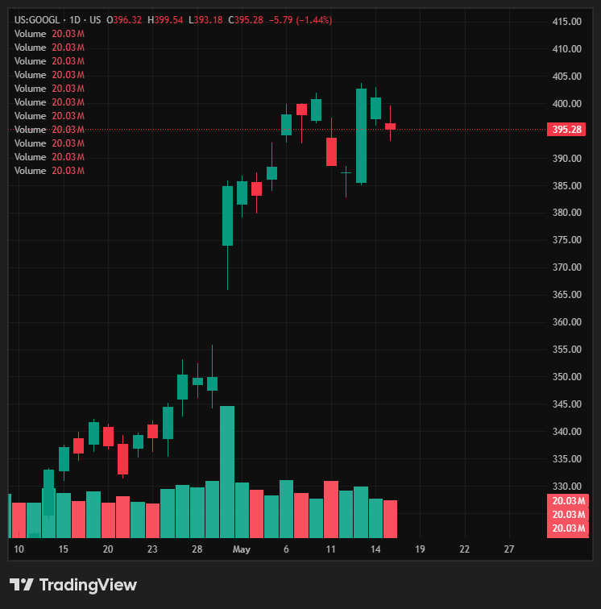

### 1-Hour Chart

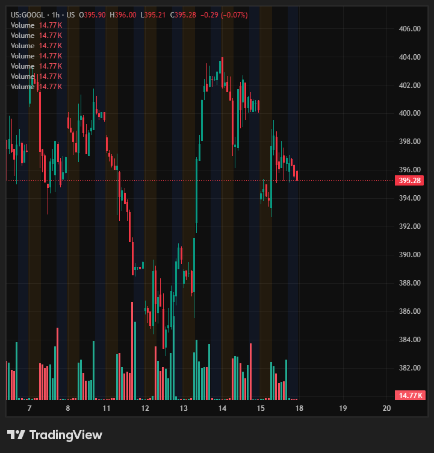

### Setup

- **Trigger:** Up and over **$397**.
- **Bias:** Very clear bull flag after rejection previous week. Daily structure consolidating higher. Solid analyst tailwind.
- **Target:** Push through **$400s** for continuation.
- **Current:** $395.28 (–1.44%).
- **Key levels:**
  - Entry: $397 break.
  - Resistance: $400 (psych), $402 (5/13 high), $405 (range top).
  - Support: $393 (recent low), $388 (flag base), $385 (post-earnings reclaim level).

### Historical Data Audit (last ~6 weeks)

- **Range:** $274 (3/27) → $402 (5/13). ~**47% rally** in 6 weeks.
- **Earnings catalyst:** **4/30 +9.96% on 71.5M volume** — massive print, gapped $349 → $384.
- **Post-earnings action:** Held the gap. Consolidated $383–$402 for 2+ weeks. No major distribution.
- **Recent thrust + pullback:** 5/13 +3.94% (27.5M) to $402 high → 3-day consolidation –0.33, –0.38, –1.07 on lighter volume (20M avg). Bull flag confirmed.
- **Pre-earnings runup:** Strong base-building $274–$355 throughout April, plus 4/8 +3.88% (32.7M), 4/14 +3.61%, 4/22 +2.12% — accumulation prior to the gap.
- **Volume signature:** Thrust days run 25–70M; consolidation days run 18–25M. Current pullback in the contraction zone — supports continuation thesis.
- **Structure:** HH/HL intact. No range break.

### Analyst Ratings Audit (30 reviewed, focus post-earnings 4/30 wave)

**Skew:** Overwhelmingly bullish. Earnings 4/30 triggered ~20 simultaneous target raises.

Last 30 days (most recent first):

| Date | Firm | Analyst | Rating | Target |
|---|---|---|---|---|
| 5/6 | Mizuho | Walmsley | Outperform | $420 → **$460** ↑ |
| 5/4 | Citizens | Boone | Market Outperform | $385 → **$515** ↑↑ (HIGH) |
| 5/4 | Freedom Broker | Ismailov | **Buy → Hold** ↓ | $365 → $400 |
| 5/1 | Stifel | Kelley | Buy | $387 → **$420** ↑ |
| 5/1 | Wells Fargo | Gawrelski | Overweight | $361 → **$427** ↑ |
| 4/30 | Canaccord | Ripps | Buy | $415 → **$450** ↑ |
| 4/30 | UBS | Ju | Neutral | $375 → $410 |
| 4/30 | Citigroup | Josey | Buy | $405 → **$447** ↑ |
| 4/30 | Morgan Stanley | Nowak | Overweight | $330 → **$375** ↑ |
| 4/30 | Susquehanna | Patil | Positive | $400 → **$460** ↑ |
| 4/30 | Cantor Fitzgerald | Mathivanan | Overweight | $395 → **$465** ↑ |
| 4/30 | Guggenheim | Morris | Buy | $375 → **$450** ↑ |
| 4/30 | Needham | Martin | Buy | $400 → **$450** ↑ |
| 4/30 | Evercore ISI | Mahaney | Outperform | $400 → $420 ↑ |
| 4/30 | Keybanc | Patterson | Overweight | $380 → $425 ↑ |
| 4/30 | RBC Capital | Erickson | Outperform | $400 → $425 ↑ |
| 4/30 | Piper Sandler | Champion | Overweight | $395 → $425 ↑ |
| 4/30 | Truist | Squali | Buy | $385 → $415 ↑ |
| 4/30 | Bernstein | Shmulik | Market Perform | $345 → $390 |
| 4/30 | Rosenblatt | Crockett | Neutral | $357 → $393 |
| 4/30 | Barclays | Sandler | Overweight | $360 → $405 ↑ |

**Takeaways:**
- Target range: **$390 (Bernstein low)** → **$515 (Citizens high)**. Median ~**$425**.
- Spot $395.28 → **~7.5% upside to median**, **~30% to high**.
- Lone downgrade: Freedom Broker (Buy → Hold, $400). Goldman absent from list — no bear voice from big tier.
- All major sell-side firms raised targets post-earnings.
- Multiple firms parked at $450+: Citizens $515, Cantor $465, Mizuho $460, Susquehanna $460, Guggenheim $450, Canaccord $450, Needham $450, Citigroup $447 = strong cluster well above current price.

### Plan

1. **Long trigger:** Up over $397 → take. Confirmation = clean break of $400 psych.
2. **Stop:** Under $393 (recent flag low) or tighter under $395 if entry near level.
3. **Targets:**
   - T1: $402 reclaim — small trim.
   - T2: $405 / $410 — scale.
   - Runner: $425+ to chase median target zone.
4. **Invalidation:** Loss of $388 = flag broken, reassess.
5. **Size:** Standard / slightly aggressive. Strongest analyst tape + clean structure of the names on the list.

---

## MU — Micron Technology

### Daily Chart

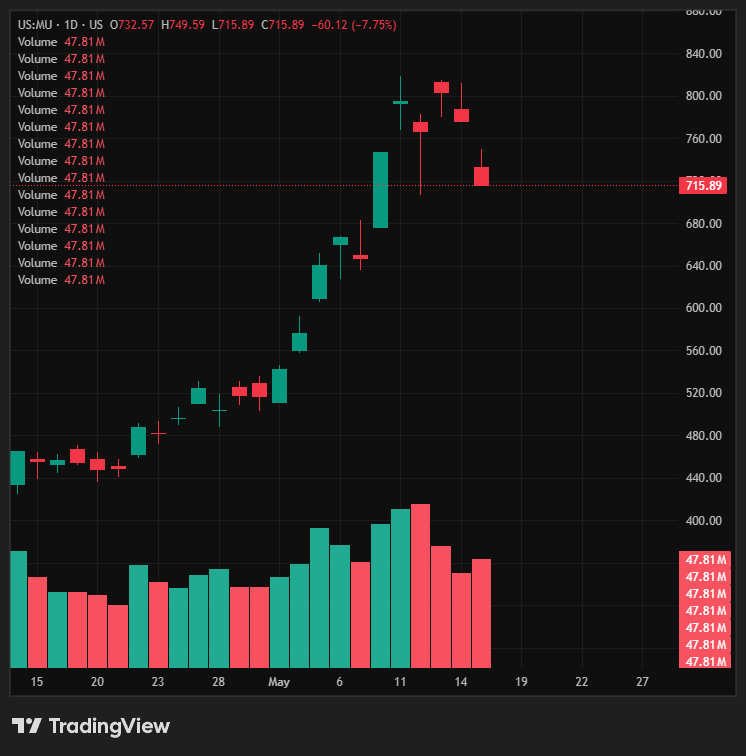

### 1-Hour Chart

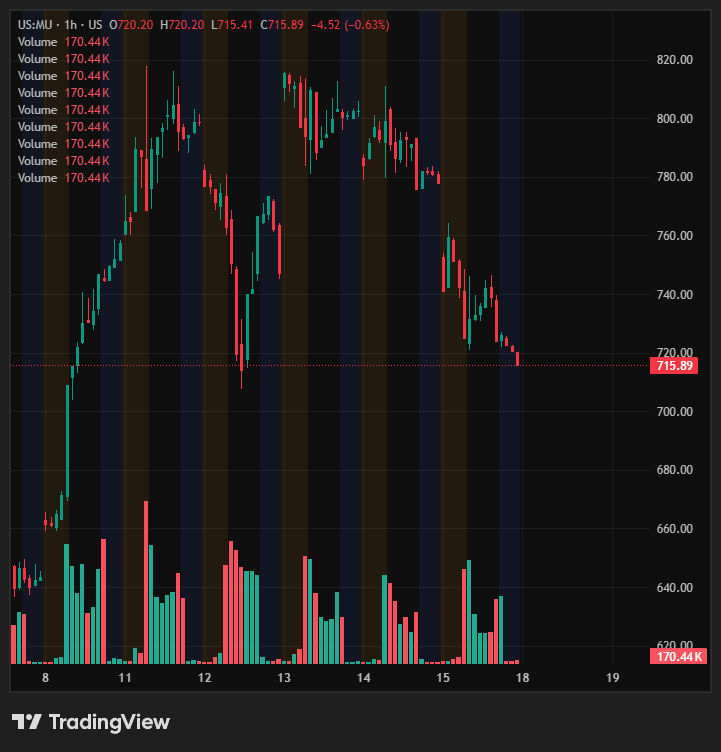

### Setup

- **Trigger:** Clean continuation over **$723–$724** → breakout back to **new ATH**.
- **Stop:** Below **$719**. Tight.
- **Bias:** Obvious ripper. Manage risk tight given price + vol.
- **Current:** $715.89 (–7.75%, –$60.12 today).
- **Key levels:**
  - Entry: $723 / $724 reclaim.
  - Resistance: $740 (intraday pivot), $776 (5/14 close), $803 (5/13 close), $815 (ATH).
  - Support: $719 (stop), $706 (5/12 low), $676 (5/8 base).

### Historical Data Audit (last ~6 weeks)

- **Range:** $321 (3/30 low) → ~**$815 ATH (5/13)**. ~**152% rally** in 6 weeks. Parabolic.
- **Thrust days:** 5/8 **+15.49%** (63.4M), 5/5 +11.06% (61.7M), 5/13 +4.83% (53.8M), 4/14 +9.17% (51.5M), 4/22 +8.48% (45.4M), 4/8 +7.72% (48.8M), 4/1 +8.88% (73.8M).
- **Current pullback:** 5/14 –3.44% (41.6M), 5/15 **–6.62% (47.8M)**. ~12% drawdown from ATH in 2 sessions.
- **Volume on pullback:** 47.8M today vs 53–70M on thrust days = **controlled distribution, not panic flush**. Volume profile favors reclaim.
- **Volatility:** Extreme. Daily ATR effectively $30–60 at current price.
- **Structure:** Sharp pullback to first horizontal support zone ($706–$724). Bull-trend intact above $676.

### Analyst Ratings Audit (30 reviewed)

**Skew:** Near-unanimous bullish.

| Date | Firm | Analyst | Rating | Target |
|---|---|---|---|---|
| 5/11 | DA Davidson | Luria | Buy | **$1000** (HIGH) |
| 4/28 | TD Cowen | — | Buy | N/A |
| 4/28 | DA Davidson | — | Buy | N/A |
| 4/27 | Melius Research | — | Buy | N/A |
| 4/8 | UBS | — | Buy | N/A |
| 3/31 | Citigroup | — | Buy | N/A |
| 3/19 | JP Morgan | — | Overweight | N/A |
| 3/19 | Mizuho | — | Outperform | N/A |
| 3/19 | BofA | — | Buy | N/A |
| 3/19 | Goldman Sachs | — | **Neutral** | N/A (only non-bull) |
| 3/19 | Barclays / Wells / RBC / Keybanc / Cantor / Needham / Rosenblatt / DB | — | Overweight / Outperform / Buy | N/A |

**Takeaways:**
- **~29 of 30 ratings bullish.** Only Goldman holds Neutral.
- DA Davidson explicit **$1000 target** (5/11) — only firm posting a number, ~40% upside from spot.
- Most firms refreshed coverage 3/19 (post-prior-quarter) all positive.
- No Sells in the book. Zero downgrades since 3/3.
- Analyst tape strongest on the list (alongside ARM/GOOGL).

### Plan

1. **Long trigger:** Reclaim $723–$724 → take. Confirm with $725+ hold on volume.
2. **Stop:** $719 — tight (~$5 risk at entry).
3. **Targets:**
   - T1: $740 — trim.
   - T2: $776 (5/14 reclaim) — scale.
   - T3: $803 (5/13 close).
   - Runner: $815+ ATH break.
4. **Invalidation:** Loss of $719 on volume → out. Loss of $706 = pullback extending.
5. **Size:** Reduced sizing on share count (high $ price + vol), but conviction high. Tight stop = small per-share risk allows position size in dollar-risk terms.
6. **Risk note:** Parabolic stock + Wed FOMC Minutes → expect chop. Skip entry mid-week if Fed creates dislocation.

---

## ACLS — Axcelis Technologies

### Daily Chart

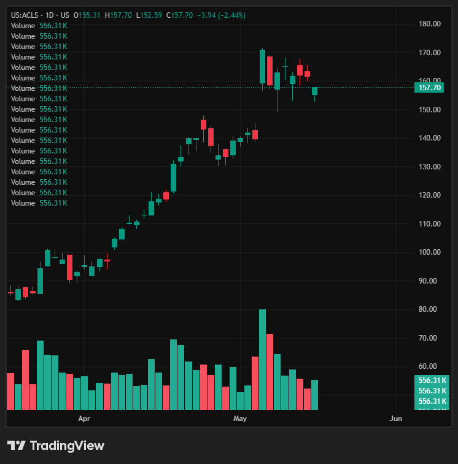

### 1-Hour Chart

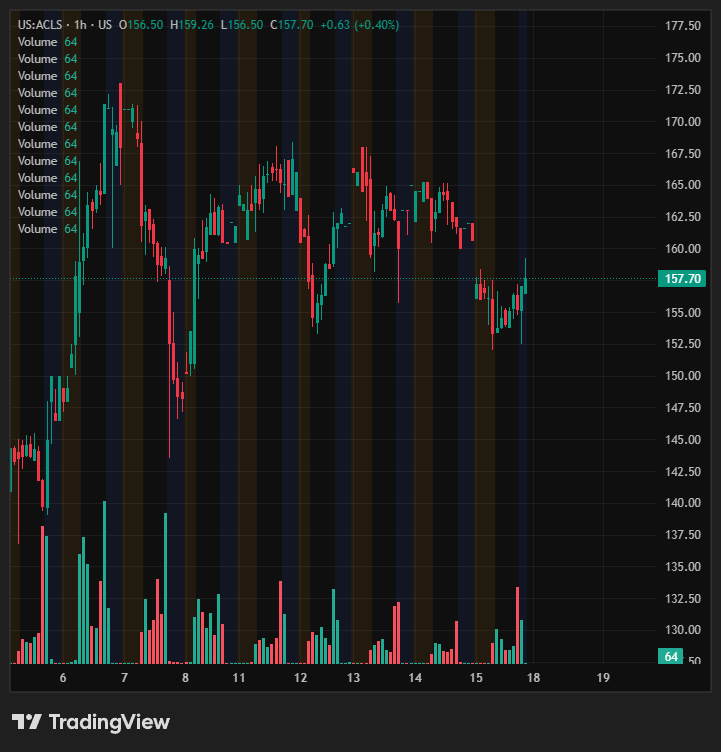

### Setup

- **Trigger:** Gap over **$160** → gap fill reversal → continuation higher.
- **Stop:** Under **$156–$155** on the expansion higher.
- **Bias:** Same semi-strength play as MU. **Coiling tighter than MU** — small ATR, cleaner range = tighter risk.
- **Current:** $157.70 (–2.44%).
- **Key levels:**
  - Entry: $160 gap reclaim.
  - Resistance: $162 (intraday pivot), $165 (range mid), $168 (5/13 swing high), $172 (5/6 ATH).
  - Support: $156–$155 (stop zone), $152 (5/15 low), $149 (5/7 low).

### Historical Data Audit (last ~6 weeks)

- **Range:** $90 (3/30) → **$171 ATH (5/6)**. ~**90% rally** in 5–6 weeks.
- **Earnings catalyst:** **5/6 +22.41% on 1.9M (4× normal vol)** — gap from $139 → $171.
- **Post-earnings:** 5/7 –7.22% (1.4M) gap-fill attempt, then 6-session sideways consolidation $155–$165.
- **Volatility profile:** Lower ATR than MU. Recent daily moves mostly ±1–4%. 5/15 –4.00% was the largest of the past week.
- **Volume signature:** Today ~556K vs earnings 1.9M = normalized, sellers thinning.
- **Coil structure:** Tight range $152–$168 for ~2 weeks. Higher low (5/15 $152) holding above 5/7 low ($149). Pre-breakout coil.
- **vs MU:** Same sector tailwind, less violent — ACLS suits tighter-stop traders, MU suits high-vol swing.

### Analyst Ratings Audit (30 reviewed)

**Skew:** **Bearish / behind the tape.** Recent ratings cluster Neutral / Underperform. Analysts not yet updated post-earnings 5/6 print.

Recent (most recent first):

| Date | Firm | Analyst | Rating | Target |
|---|---|---|---|---|
| 2/18 | B. Riley | Ellis | Neutral | $94 → **$91** ↓ |
| 1/21 | B. Riley | Ellis | Neutral | $84 → $94 |
| 1/13 | BofA | Jang | **Underperform** | $99 → $100 |
| 11/5 | B. Riley | Ellis | Neutral | $85 → $84 |
| 10/13 | BofA | Jang | Neutral → **Underperform** ↓ | $81 → $90 |
| 10/2 | DA Davidson | Diffely | Buy | $90 → **$110** ↑ (recent bull) |
| 10/2 | Benchmark | Miller | Hold → **Buy** ↑ | $105 |
| 4/21 | B. Riley | Ellis | **Buy → Neutral** ↓ | $80 → $50 (cut) |

**Takeaways:**
- **Spot $157.70 trades ABOVE every recent target.** DA Davidson $110 is the highest live bull number — already 43% below current price.
- BofA Underperform $100, B. Riley Neutral $91 = consensus bear/neutral.
- Older 2024-era targets ($170–$190 from Benchmark, B. Riley pre-cut) reflect a different price regime.
- Analyst tape **lags** the technical setup. Watch for fresh post-earnings revisions — likely catalyst if upgrades arrive.
- **Trade implication:** Long thesis is technical, not consensus. No analyst tailwind like ARM/GOOGL/MU. Tighter stop discipline matters more.

### Plan

1. **Long trigger:** Gap > $160 → take on reclaim. Confirm with $162+ hold on volume expansion.
2. **Stop:** $156–$155. ~$4–5 risk at entry.
3. **Targets:**
   - T1: $165 (range mid) — trim.
   - T2: $168 (5/13 swing high) — scale.
   - T3: $172 (ATH) — runner.
   - Stretch: $180+ on breakout if upgrade catalyst hits.
4. **Invalidation:** Loss of $155 on volume → out. Loss of $152 = coil broken.
5. **Size:** Standard. Tighter coil = better R/R per share than MU. Smaller name + thin float (~600K avg vol) = avoid oversize.
6. **Risk note:** No analyst tailwind. Pure tape play. Tight stops mandatory.

---

## CLF — Cleveland-Cliffs Inc.

### Daily Chart

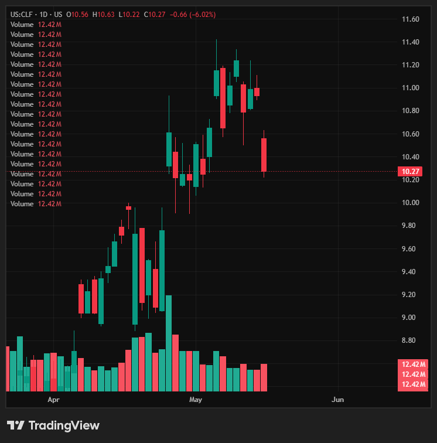

### 1-Hour Chart

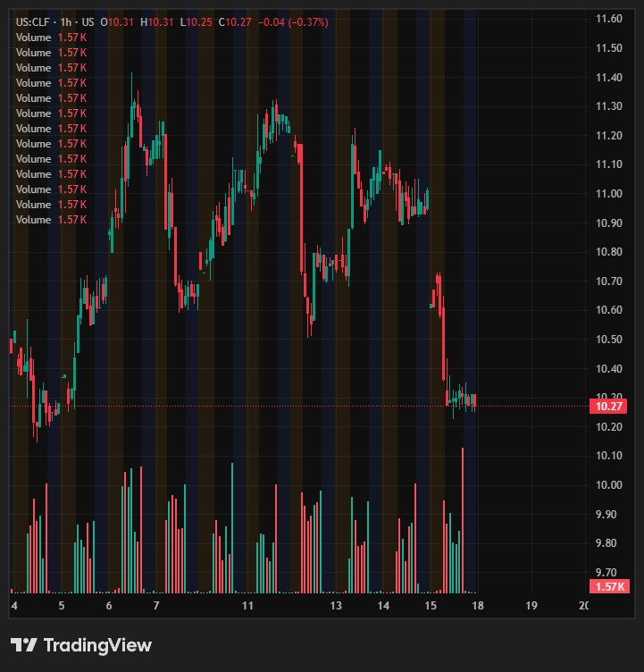

### Setup

- **Trigger:** Gap over **$10.50**, hold strength → gap fill reversal back higher.
- **Bias:** Nice upside potential but **slow climber** — needs **longer expiration options or shares**, not weeklies.
- **Current:** $10.27 (–6.02%).
- **Key levels:**
  - Entry: $10.50 gap reclaim.
  - Resistance: $10.65 (5/15 open), $10.80 (range mid), $11.00 (psych), $11.24 (5/11 high), $11.42 (recent swing high).
  - Support: $10.22 (5/15 low), $10.00 (psych), $9.76 (4/24 close).

### Historical Data Audit (last ~6 weeks)

- **Range:** $8.11 (3/30 low) → $11.42 (5/6–5/11 high) → $10.27 now. ~**41% rally** then ~10% pullback.
- **Slow grinder confirmed:** Daily % moves smaller than semi names, but on a $10 stock $0.30 moves register as 3% — noisy in percentage terms, small in dollars.
- **Big thrust days:** 4/27 +8.71% (44.2M), 4/22 +4.05% (26.6M), 4/24 +7.37% (19.3M), 5/6 +4.69% (18.3M), 5/8 +3.47% (10.6M).
- **Big down days:** 5/15 –5.67% (12.4M today), 4/21 –6.17% (24.8M), 5/7 –4.48% (16M), 4/28 –3.68% (26M).
- **Volume signature:** Today 12.4M on the flush = below the 18–44M thrust-day prints = orderly pullback, not panic distribution.
- **Structure:** Uptrend $8→$11 intact. Current pullback testing prior breakout zone ($10.00–$10.50). Hold = bull continuation; loss of $10 = trend in jeopardy.
- **Options implication:** Low $ price + slow grind → IV-decay risk on short-dated calls. **30–60 DTE or shares** is the correct vehicle.

### Analyst Ratings Audit (30 reviewed)

**Skew:** Mixed / slightly bearish on revisions. Most ratings cluster Neutral / Equal-Weight.

Recent (most recent first):

| Date | Firm | Analyst | Rating | Target |
|---|---|---|---|---|
| 4/— | Morgan Stanley | De Alba | Overweight | $16.8 → **$12** ↓ |
| 4/— | JP Morgan | Peterson | Neutral | $13 → **$10** ↓ |
| 3/— | Wells Fargo | Tanners | Equal-Weight | $12 → **$9** ↓ |
| 3/— | GLJ Research | Johnson | **Sell** | $9.42 → $9.42 |
| 2/— | Citigroup | Hacking | Neutral | $11 → **$13** ↑ |
| 1/— | Morgan Stanley | De Alba | EW → **Overweight** ↑ | $12.8 → **$17** ↑ |
| 1/— | Keybanc | Gibbs | OW → **Sector Weight** ↓ | N/A |
| — | Goldman Sachs | Harris | Buy | $14.5 → **$16** ↑ |

**Takeaways:**
- Target range: **$9 (Wells low)** → **$17 (MS earlier high)**. Recent median ~$11–12.
- Spot $10.27 → **~10–15% upside to median, ~55% to Goldman $16, ~65% to MS $17**.
- Recent revisions skew lower: MS cut $16.8→$12, JPM cut $13→$10, Wells cut $12→$9.
- Bull voices: Morgan Stanley (still Overweight), Goldman Buy, Keybanc (downgraded recently though).
- GLJ Research persistent Sell at $9.42 — lone deep bear.
- Analyst tape **not a tailwind**. Setup is technical: tape reclaim of $10.50 + sector cyclicality.

### Plan

1. **Long trigger:** Gap > $10.50 → take on reclaim + strength hold.
2. **Vehicle:** **Shares or 30–60 DTE calls.** Avoid weekly options (slow grind = theta burn).
3. **Stop:** Under $10.00 (psych + 5/15 low zone). $0.50 risk per share.
4. **Targets:**
   - T1: $10.80 (range mid) — trim.
   - T2: $11.00 (psych) — scale.
   - T3: $11.24 / $11.42 (range high) — runner.
   - Stretch: $12+ on continuation (matches MS / JPM lowered targets).
5. **Invalidation:** Loss of $10.00 = trend break, reassess.
6. **Size:** Larger share count OK (low $ price), but cap dollar risk same as other plays. Slow mover = patience required.
7. **Risk note:** No analyst tailwind. Cyclical (steel) — watch sector tone + commodity prints.

---

## CIFR — Cipher Mining Inc.

### Daily Chart

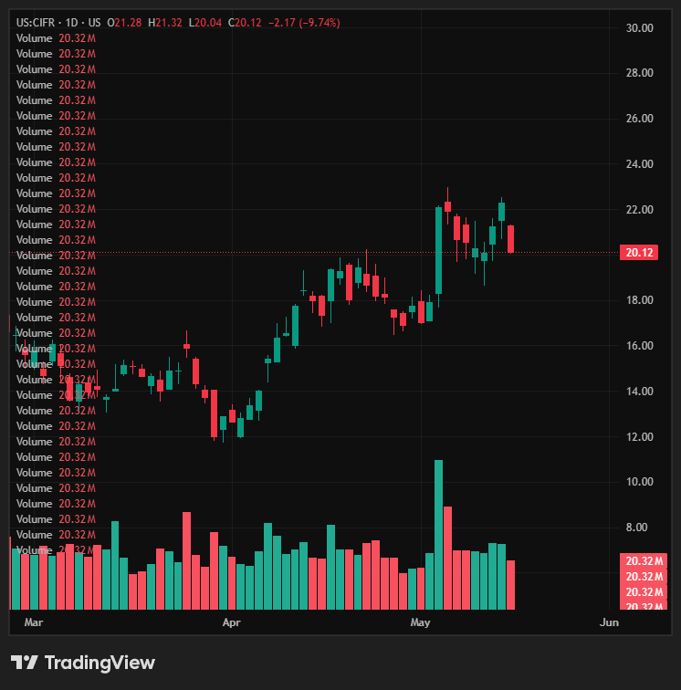

### 1-Hour Chart

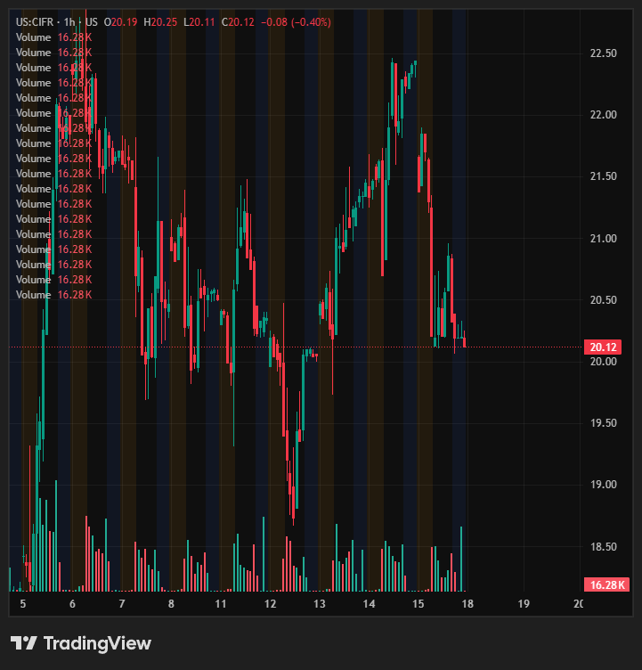

### Setup

- **Trigger:** Breakout over **$20.30** → look for expansion to **new highs**.
- **Stop:** Tight (under $20 / under 5/15 low $20.04).
- **Bias:** Coiling above $20 post-earnings. Clean continuation setup.
- **Current:** $20.12 (–9.74%).
- **Key levels:**
  - Entry: $20.30 break.
  - Resistance: $20.55 (5/8 close), $21.24 (5/13 close), $22.29 (5/14 close), $22.96 (recent ATH zone).
  - Support: $20.04 (5/15 low), $19.67 (5/7 low), $18.65 (5/12 low / structure pivot).

### Historical Data Audit (last ~6 weeks)

- **Range:** $12.02 (3/30 low) → **$22.96 high (mid-May)**. ~**91% rally** in 6 weeks.
- **Earnings catalyst:** **5/5 +23.53% on 62.5M** — explosive print. Gapped $17.89 → $22.10.
- **Post-earnings:** 2-week consolidation $20–$22.50. Range holding above pre-earnings level.
- **Recent thrust days:** 5/13 +5.88% (27.4M), 5/14 +4.94% (27.2M), 4/17 +11.71% (35.1M), 4/8 +10.06% (35.9M), 4/22 +7.76% (22.4M).
- **Down days:** 5/15 –8.79% (20.3M today), 5/7 –5.59% (25M), 4/21 –6.48% (25M).
- **Volume signature:** Today 20.3M flush = below thrust-day vol (27–62M) = orderly pullback into range support.
- **Structure:** Clean stair-step uptrend. Each pullback higher low. Today's $20 retest = third major support test, all volume-confirmed bounces previously.

### Analyst Ratings Audit (30 reviewed)

**Skew:** **Unanimously bullish.** Zero Sells/Holds/Neutrals on the live book.

Recent (most recent first):

| Date | Firm | Analyst | Rating | Target |
|---|---|---|---|---|
| 5/15 | Needham | Todaro | Buy | $22 → **$25** ↑ |
| 5/14 | Jefferies | Petersen | Buy | **$32** (HIGH) |
| 5/7 | Keefe Bruyette | Glagola | Outperform | $23 → **$27** ↑ |
| 5/7 | Rosenblatt | — | Buy | N/A |
| 5/7 | Macquarie | — | Outperform | N/A |
| 5/6 | HC Wainwright | — | Buy | N/A |
| 5/6 | BTIG | — | Buy | N/A |
| 4/9 | Cantor Fitzgerald | — | Overweight | N/A |
| 11/24 | JP Morgan | — | Neutral → **Overweight** ↑ | N/A |

**Takeaways:**
- **All 30 ratings = bullish** (Buy / Outperform / Overweight). No Holds, Sells, or Neutrals in book.
- JPM upgraded Neutral → Overweight 11/24 — last bear voice fell.
- Target range: $25 (Needham) → **$32 (Jefferies high)**.
- Spot $20.12 → **~24% to Needham, ~34% to Keefe $27, ~59% to Jefferies $32**.
- Post-earnings reactions: 3 firms raised targets in 8 days — fresh tailwind.
- Analyst tape strength tier with GOOGL / ARM / MU / IREN.

### Plan

1. **Long trigger:** Break $20.30 → take.
2. **Stop:** Under $20.00 (psych + 5/15 low). ~$0.30 risk at entry.
3. **Targets:**
   - T1: $20.55 — trim.
   - T2: $21.24 (5/13 close) — scale.
   - T3: $22.30 (5/14 close) — scale.
   - Runner: $23+ → new highs leg.
4. **Invalidation:** Loss of $20.00 on volume → out. Loss of $19.67 = post-earnings range broken.
5. **Size:** Standard. Tight stop = good R/R. Crypto-mining sensitivity → watch BTC tape.
6. **Risk note:** High beta to crypto + power names. Strong analyst tailwind. Sector rotation can compress range fast.

---

*Next ticker: pending.*
